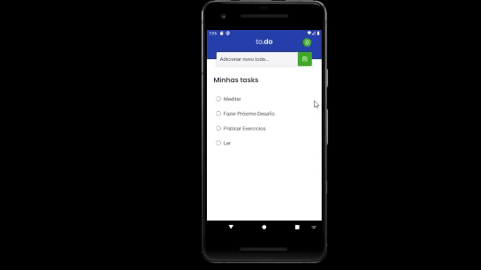

<h1 align="center">
  DEMONSTRAÇÃO
</h1>

  

## Sobre o projeto: 
**Este desafio é uma continuação do [Desafio 01](https://github.com/JoseCarlos33/Desafio01-Trilha-React-Native-Rocketseat-Ignite) do curso Ignite da Rocketseat, que consiste da criação de um botão que possibilite a troca de temas após ser clicado**

## Para este projeto foi utilizado:

* [ ] React Native
* [ ] TypeScript
* [ ] Context API
* [ ] Icon

## Autor

**José Carlos Noronha**